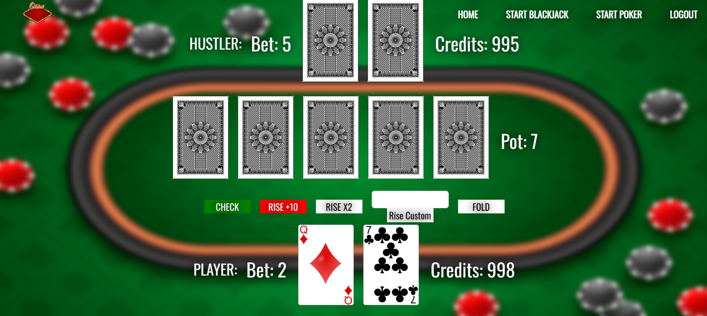

# SecurityPlayApp

Projekt aplikacji webowej (backend/frontend) w Spring Boot. 
Aplikacja umożliwia dla zalogowanych użytkowników rozegranie gry w Black Jack lub Poker przeciwko "botowi" z zaimplementowanym schematem ruchów.
## Wykorzystane Technologie

- **Spring Boot**
- **Spring Data JPA**
- **Spring Security**
- **Oauth2**
- **Thymeleaf**
- **H2 Database**
- **Lombok**
- **Bootstrap (WebJars)**

## Budowanie i Uruchamianie Aplikacji

Aby zbudować i uruchomić aplikację lokalnie, postępuj zgodnie z poniższymi krokami:

1. Sklonuj repozytorium na swój lokalny komputer.
   ```bash
   git clone https://github.com/your-username/SecurityPlayApp.git
   
2. Uruchom `SecurityPlayAppApplication` w głównym pakiecie, lub: 
   ```bash
   cd SecurityPlayApp
   ./mvnw spring-boot:run

## Funkcje

- **Dla niezalogowanych użytkowników:**
  - Strona główna
  
  - Formularz logowania 
    - za pomocą 'lokalnego' użytkownika z danymi przechowywanymi w bazie danych
    - za pomocą Oauth2 - konto GitHub
    
  - Formularz rejestracji
  

- **Dla zalogowanych użytkowników:**
  - rozgrywka w Black Jack
  
  - rozgrywka w Pokera
  
  - wylogowanie
   
## Autor

**Karol Bazgier**
- karol5108@gmail.com
- kbazgier@student.wszib.edu.pl